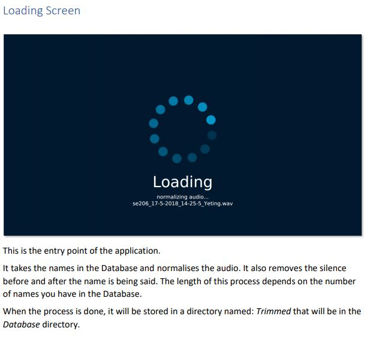

# NameSayer
Names are often mispronounced due to a difference in cultural background and language barriers. **NameSayer** is a program where the user 
can learn to pronounce names from a library, and then also add their own name to the library for others to learn. 
 
 
 
 

Project was done with my project partner Ryan Lim awesome guy to work with, check out his github:
https://github.com/pabloSushibar
